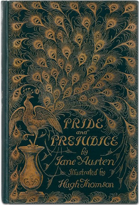
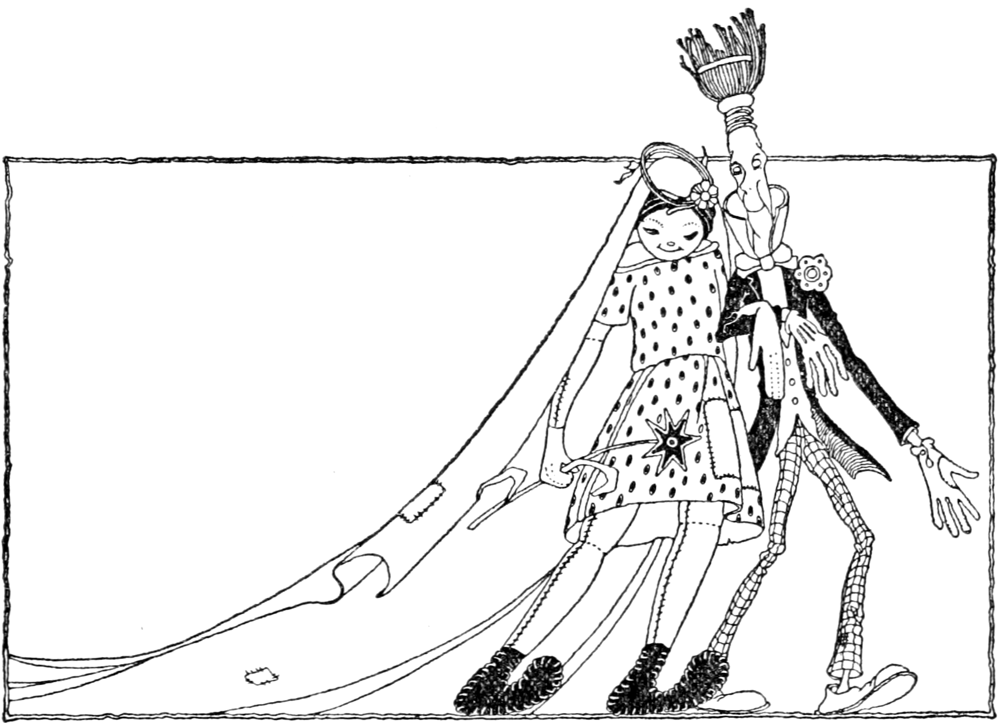

```{r child = 'pre-chapter-script.Rmd'}
```

# Literature
Some text and exercises, and a demonstration vignette.

Read more of Rootabaga Stories at https://www.gutenberg.org/files/27085/27085-h/27085-h.htm
\marginpar{\qrcode[height=0.5in]{https://www.gutenberg.org/files/27085/27085-h/27085-h.htm}}

Or if you want something a little longer, read *Pride and Prejudice* or *Emma*, in the `austen`\indexfosdata{austen}
data set from the `fosdata` package.

```{r peacock, echo=FALSE, fig.align="center", fig.cap="Pride and Prejudice book cover."}

```

\photocredit{Peacock cover. Found this on the web somewhere.}

## The Wedding Procession of the Rag Doll and the Broom Handle and Who Was in It

The Rag Doll had many friends. The Whisk Broom, the Furnace Shovel, the Coffee Pot, they all liked the Rag Doll very much.

But when the Rag Doll married, it was the Broom Handle she picked because the Broom Handle fixed her eyes.

A proud child, proud but careless, banged the head of the Rag Doll against a door one day and knocked off both the glass eyes sewed on long ago. It was then the Broom Handle found two black California prunes, and fastened the two California prunes just where the eyes belonged. So then the Rag Doll had two fine black eyes brand new. She was even nicknamed Black Eyes by some people.

There was a wedding when the Rag Doll married the Broom Handle. It was a grand wedding with one of the grandest processions ever seen at a rag doll wedding. And we are sure no broom handle ever had a grander wedding procession when he got married.

```{r ragbroom, echo=FALSE, fig.align="center", out.width="50%"}

```

\photocredit{This work is in the public domain in the United States because it was published (or registered with the U.S. Copyright Office) before January 1, 1926. (\url{https://commons.wikimedia.org/wiki/File:Rootabaga_Stories_-_Story_4_Headpiece.png})}

Who marched in the procession? Well, first came the Spoon Lickers. Every one of them had a tea spoon, or a soup spoon, though most of them had a big table spoon. On the spoons, what did they have? Oh, some had butter scotch, some had gravy, some had marshmallow fudge. Every one had something slickery sweet or fat to eat on the spoon. And as they marched in the wedding procession of the Rag Doll and the Broom Handle, they licked their spoons and looked around and licked their spoons again.

Next came the Tin Pan Bangers. Some had dishpans, some had frying pans, some had potato
peeling pans. All the pans were tin with tight tin bottoms. And the Tin Pan Bangers banged with knives and forks and iron and wooden bangers on the bottoms of the tin pans. And as they marched in the wedding procession of the Rag Doll and the Broom Handle they banged their pans and looked around and banged again.

Then came the Chocolate Chins. They were all eating chocolates. And the chocolate was slippery and slickered all over their chins. Some of them spattered the ends of their noses with black chocolate. Some of them spread the brown chocolate nearly up to their ears. And then as they marched in the wedding procession of the Rag Doll and the Broom Handle they stuck their chins in the air and looked around and stuck their chins in the air again.

Then came the Dirty Bibs. They wore plain white bibs, checker bibs, stripe bibs, blue bibs and bibs with butterflies. But all the bibs were dirty. The plain white bibs were dirty, the checker bibs were dirty, the stripe bibs, the blue bibs and the bibs with butterflies on them, they were all dirty. And so in the wedding procession of the Rag Doll and the Broom Handle, the Dirty Bibs marched with their dirty fingers on the bibs and they looked around and laughed and looked around and laughed again.

Next came the Clean Ears. They were proud. How they got into the procession nobody knows. Their ears were all clean. They were clean not only on the outside but they were clean on the inside. There was not a speck of dirt or dust or muss or mess on the inside nor the outside of their ears. And so in the wedding procession of the Rag Doll and the Broom Handle, they wiggled their ears and looked around and wiggled their ears again.

```{r child = "02v-sandburg.Rmd"}
```

## Exercises {-}

Exercises \@ref(ex:loss) - \@ref(ex:matching) require you to read this chapter.

::: {.exercise #ex:loss}
How did Rag Doll lose her eyes?
:::

::: {.exercise #ex:fixed}
Who fixed Rag Doll's eyes?
:::

::: {.exercise #ex:remade}
What are Rag Doll's eyes made of now?
:::

::: {.exercise #ex:nickname}
What was Rag Doll's nickname?
:::

::: {.exercise #ex:procession}
Why was there a procession?
:::

::: {.exercise #ex:matching}
In the passage there were five groups in the procession. They were the Spoon Lickers, the Tin Pan Bangers, the Chocolate Chins, the Dirty Bibs, and the Clean Ears. Write  the correct group for each description below.

a. Used knives and forks __________________________
b. Had something sweet or fat__________________________
c. Wiggled something  __________________________
d. Had chocolate on the end of their noses __________________________
e. Laughed as they looked around _________________________

:::
